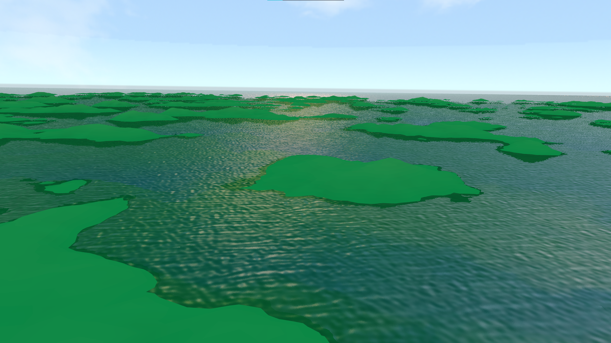
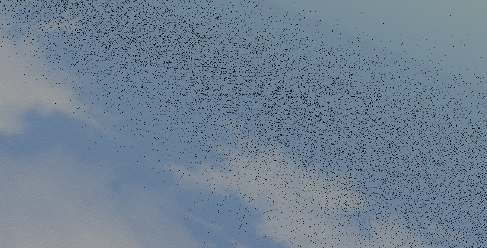

**Antoine Dumoulin**

# Projet de programmation graphique 3D

## UI (slide bar)

- `precision`   : le nombre de vertex utilisé
- `size`        : la largeur du terrain
- `elevation`   : la force du bruit

## Génération du terrain

J'ai codé une génération procédurale du terrain.
Pour la faire j'ai réutilisé l'instanciation de la grille de vertex du TP2.
Et j'y ai ensuite ajouté un bruit en `y` en fonction de la position `xz`.
Il suffisait après d'adapter la valeur de la hauteur à la `color map` pour sélectionner la bonne couleur. xxxxx
J'ai calculé les normales avec la méthode des différences finies.

Pour pouvoir visualiser un plus grand terrain j'ai reculéx la caméra de manière à ce que le frustrum ne perturbe aps trop la caméra. 

## Rendu de l'eau

J'utilise un FBO pour la reflexion et un autre pour la refraction.
Je fais rendre le terrain et la skybox dans ces deux FBO. Pour la reflexion, comme la caméra d'ewgl a posé quelques soucis, j'ai decidé d'inverser le monde à la place. J'ai juste multiplié les valeurs en `y` de la skybox par `-1` et du terrain par une symétrie par rapport à l'eau, c'est-à-dire multiplié par `-1` puis déplacé par rapport à la hauteur de l'eau. Je mix ensuite les textures attachées à ces FBO avec le coefficient de fresnel.

L'eau est constitué d'un carré formé de 4 vertex. J'ai simplement augmenté les valeurs de positions pour qu'elle s'étende à "l'infini". Les textures y sont plaqué avec répétition. 

J'ai essayé d'ajouter du bruit pour faire des vagues. J'ai tenté une approche sans augmenter le nombre de vertex. Il a été malheuresement impossible d'adapter la distorsion pour qu'elle ne se décuple ni aux bords, ni dans le temps.
J'ai aussi ajouté un léger bruit aléatoire pour flouter un peu la surface de l'eau. Je décale très légèrement les coordonnées de textures.

Il y a des artéfacts de moire qui apparraissent à grande distance. Il faudrait mettre en place un antialiasing.

## Résultats

J'ai essayé de donner une couleur de soleil à la spécularité.

J'ai pu voir une différence entre certain PC au niveau de la specularité :
Il est probable que la puissance soit calculée différement. J'ai donc ajouté un `clamp` pour éviter que ces pixels noirs apparraissent à la surface de l'eau.

